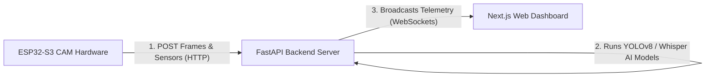

# Auranexus Hardware Integration Guide (ESP32-S3 CAM)

This guide outlines how to establish an end-to-end data pipeline between your physical **ESP32-S3 CAM** board, the **FastAPI backend**, and the **Next.js web console**.

---

## 🛰️ Architecture Overview



1. **ESP32-S3 CAM** captures camera frames (OV2640) and reads environment sensors.
2. It sends this data to the local **FastAPI Backend Gateway** using HTTP POST requests.
3. The **FastAPI Backend** runs real-time YOLOv8 inference for target object classification and logs the metrics.
4. The backend broadcasts the results to the **Next.js Dashboard Client** in real-time via WebSockets.

---

## 🛠️ Step 1: Flash the ESP32-S3 CAM Firmware

Open the pre-configured sketch in your Arduino IDE:
* **Sketch Location**: [esp32-s3-cam-firmware/esp32-s3-cam-firmware.ino](file:///c:/AURANEXUS/esp32-s3-cam-firmware/esp32-s3-cam-firmware.ino)

### Configuration Checklist:
1. **Select WiFi Credentials**:
   Modify lines 15-16 to match your local router:
   ```cpp
   const char* ssid = "YOUR_WIFI_SSID";
   const char* password = "YOUR_WIFI_PASSWORD";
   ```
2. **Set Backend IP**:
   Modify line 19 to point to your computer's local network IP address (e.g., `192.168.1.XX`):
   ```cpp
   const char* serverIP = "192.168.1.100"; 
   ```
3. **Select Camera Pinout**:
   By default, the sketch is configured for the **Freenove ESP32-S3 CAM**. If you are using an **Espressif ESP32-S3 EYE** or a different variant, uncomment the corresponding pin-mapping block in the sketch.

### Arduino IDE Flash Settings:
* **Board**: `ESP32S3 Dev Module`
* **USB CDC On Boot**: `Enabled` (necessary for console printing)
* **Flash Size**: `8MB` (or matching your board)
* **Partition Scheme**: `Huge APP (3MB No OTA/1MB SPIFFS)`
* **PSRAM**: `OPI PSRAM` (Required for video frame buffers)

---

## 🐍 Step 2: Start the FastAPI Backend Gateway

To receive incoming telemetry streams from the ESP32 and serve the WebSocket channel, boot the backend:

1. Open a terminal, move into the backend folder, and install dependencies:
   ```bash
   cd backend
   pip install -r requirements.txt
   ```
2. Run the server, binding to `0.0.0.0` so other devices on your local network (like the ESP32) can communicate with it:
   ```bash
   uvicorn app.main:app --host 0.0.0.0 --port 8000
   ```
3. Open your browser to `http://localhost:8000/docs` to see the live Swagger API document.

---

## 💻 Step 3: Run the Web Dashboard Client

1. Open a new terminal in the frontend workspace folder:
   ```bash
   cd aura-nexus
   npm run dev
   ```
2. Open `http://localhost:3000` in your browser.
3. Click **"Connect Device"** or **"Enter Console"** to activate the telemetry listener which opens the WebSocket bridge to `ws://localhost:8000/api/v1/ws/telemetry`.
